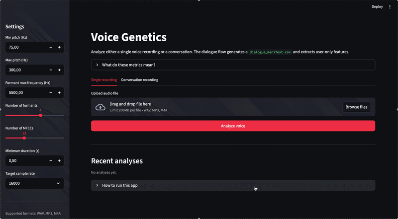

# Voice Genetics

An interactive application for **voice analysis and acoustic feature extraction**, combining a **Streamlit frontend** with a **FastAPI backend**.

The project is being extended toward **conversation-level voice phenotyping** for acoustic-genetic research: diarization, user-voice extraction, and standardized feature vectors without storing raw audio in outputs.

👉 **Live app:**
[https://voice-genetics.streamlit.app](https://voice-genetics.streamlit.app)

---

## Demo



---

## Features

### Streamlit App (User Interface)

* 🎤 Upload and analyze voice recordings directly in the browser
* 📊 Interactive visualization of:

  * Pitch (F0)
  * Formants
  * MFCCs
  * Voice quality (jitter, shimmer, HNR)
* 🧬 **Genetic Prediction** – Predicts rs11046212 genotype (ABCC9 gene) from voice features
* Built-in explanations for each metric (UI-friendly)
* Download results as JSON or CSV
* History of recent analyses

### 🧬 Genetic Prediction Model

Based on the GWAS study by **Gisladottir et al. (Science Advances, 2023)**:

- **SNP:** rs11046212 in the **ABCC9** gene
- **Effect:** Each T allele raises voice pitch by ~2.1 Hz (β = 0.114 SD, P = 3×10⁻¹⁸)
- **Model:** Random Forest classifier trained on synthetic data following Hardy-Weinberg principles
- **Features used:** pitch_mean, pitch_variability, jitter, shimmer, HNR
- **Output:** Predicted genotype (CC, CT, or TT) with confidence probabilities

---

### ⚙️ Backend API (FastAPI)

* 🚀 High-performance REST API
* 🎵 Audio processing with `librosa` and `parselmouth`
* 📊 Feature extraction using `numpy` and `scipy`
* 📁 File upload support
* 📚 Swagger UI documentation
* 🔄 Real-time feature extraction
* 🗣 Dialogue diarization and role-aware analysis
* 🔐 Backend raw-audio storage by `audio_id`
* 🧬 Genetic prediction endpoint (`/genetic/predict`)

---

## 🧠 Extracted Features

The system analyzes voice recordings and extracts:

* **Pitch (F0):** mean, min, max, variability
* **Voice quality:** jitter, shimmer, harmonic-to-noise ratio (HNR)
* **Timbre:**

  * Formants (F1–F4+)
  * MFCCs (spectral features)
* **Recording quality:**

  * Duration
  * Signal-to-noise ratio (SNR)
  * Background noise level

> ⚠️ These metrics are for analysis and research purposes only and are **not a medical diagnosis**.

---

## 🚀 Quick Start

### ▶️ Run Streamlit App (recommended)

```bash
# Install dependencies
pip install -r requirements.txt

# Run Streamlit
streamlit run streamlit_app.py
```

Then open:

```
http://localhost:8501
```

---

### ⚙️ Run FastAPI Backend (optional)

```bash
uvicorn app:app --host 0.0.0.0 --port 8000 --reload
```

Open:

* API: [http://localhost:8000](http://localhost:8000)
* Swagger UI: [http://localhost:8000/docs](http://localhost:8000/docs)

---

## 🧬 Genetic Prediction API

### `POST /genetic/predict`

Predict genotype from voice recording.

**Request:** Multipart form with audio file (WAV, MP3, M4A)

**Response:**
```json
{
    "genotype": "CT",
    "genotype_code": 1,
    "probabilities": {
        "CC": 0.25,
        "CT": 0.55,
        "TT": 0.20
    },
    "snp": "rs11046212",
    "gene": "ABCC9",
    "clinical_note": "Your voice pattern suggests the CT genotype...",
    "extracted_features": {
        "pitch_mean": 152.3,
        "pitch_variability": 0.14,
        "jitter": 0.72,
        "shimmer": 0.31,
        "hnr": 23.5
    }
}
```

---

## Dialogue Pipeline

For conversational recordings, use the dialogue workflow instead of analyzing the whole file as one speaker.

1. `POST /dialogue/diarize` to split a conversation into speech turns and speaker clusters.
2. The diarization output assigns semantic roles by matching voice similarity against stable speaker profiles: `assistant_1` is seeded from the first assistant voice, `user` from the first user voice, and any later distinct assistant voices become `assistant_2`, `assistant_3`, and so on. Hold music is labeled `music` only by a conservative fallback heuristic.
3. `POST /dialogue/analyze` with the audio file and a segment manifest to extract user-only features.

Recommended manifest format:

```csv
segment_id,start_sec,end_sec,analysis_start_sec,analysis_end_sec,role,speaker_id,speaker_cluster,turn_type,is_barge_in,text,source
turn_001,0.00,2.84,0.00,2.84,assistant_1,speaker_1,4,speech,false,"Hello, I need help",manifest
turn_002,2.90,4.20,3.15,4.20,user,speaker_2,5,barge_in,true,"Sure, let's continue",manifest
turn_003,4.25,5.30,4.25,5.30,assistant_2,speaker_3,2,speech,false,"Please confirm",manifest
```

Required fields:

* `segment_id`
* `start_sec`
* `end_sec`
* `analysis_start_sec` and `analysis_end_sec` when you want the role-aware extractor to trim overlap
* `role` (`assistant_1`, `user`, `assistant_2`, `assistant_3`, ... or `music`)

The manifest generated from diarization keeps the first turn as `assistant_1`, the second turn as `user`, and then continues numbering additional assistant voices when a new voice profile appears. Hold music is labeled `music`. `speaker_id` is a stable canonical voice label like `speaker_1`, `speaker_2`, while `speaker_cluster` remains the technical diarization cluster.

Optional fields:

* `speaker_id`
* `text`
* `source`

This is the preferred path for client phone recordings because the target is the user's voice, not the whole dialogue.

For local batch processing, use:

```bash
python scripts/analyze_dialogue_dataset.py \
  --input-dir data \
  --manifest data/dialogue_manifest.csv \
  --output-dir outputs
```

To keep raw audio outside the repo, upload it to backend storage first:

```bash
curl -F "file=@call.mp3" "http://localhost:8000/audio/upload?purpose=dialogue"
```

Then analyze by `audio_id` instead of re-sending the file.

---

### 🐳 Using Docker

```bash
# Build image
docker build -t voice-genetics .

# Run container
docker run -d -p 8000:8000 --name voice-genetics voice-genetics
```

---

## API Endpoints

| Method | Endpoint         | Description                          |
| ------ | ---------------- | ------------------------------------ |
| GET    | `/health`        | Health check                         |
| POST   | `/audio/upload`  | Store raw audio in backend storage    |
| GET    | `/audio/{audio_id}/metadata` | Get stored audio metadata |
| POST   | `/extract`       | Extract features from one audio file |
| POST   | `/extract/batch` | Extract features from multiple files |
| POST   | `/genetic/predict` | Predict genotype from voice (**NEW**) |
| POST   | `/dialogue/manifest` | Generate `dialogue_manifest.csv` from diarization |
| POST   | `/dialogue/diarize` | Split a conversation into speech turns |
| POST   | `/dialogue/analyze` | Analyze a labeled dialogue and extract user features |
| POST   | `/dialogue/analyze-stored` | Analyze a stored audio object by `audio_id` |
| GET    | `/config`        | Get current configuration            |
| POST   | `/config`        | Update extraction settings           |

---

## Dependencies

| Package           | Purpose                     |
| ----------------- | --------------------------- |
| streamlit         | UI framework                |
| fastapi           | Backend API                 |
| uvicorn           | ASGI server                 |
| numpy             | Numerical computing         |
| scipy             | Scientific computing        |
| librosa           | Audio analysis              |
| praat-parselmouth | Phonetic feature extraction |
| pandas            | Data handling               |
| soundfile         | Audio I/O                   |
| scikit-learn      | Genetic prediction model    |
| joblib            | Model serialization         |

---

## Project Structure

```
voice-genetics/
│
├── streamlit_app.py      # Streamlit frontend
├── app.py                # FastAPI backend
├── audio_processor.py    # Feature extraction logic
├── dialogue_processor.py # Dialogue diarization and user-role analysis
├── genetic_model.py      # Genetic prediction model (Random Forest)
├── storage.py            # Backend raw-audio storage abstraction
├── config.py             # Configuration
├── requirements.txt
├── Dockerfile
├── models/               # Saved trained models
│   └── genotype_model.pkl
└── scripts/              # Batch processing utilities
    ├── analyze_dialogue_dataset.py
    └── analyze_voice_dataset.py
```

---

## 💡 Notes

* The **Streamlit app is the main interface** for users
* The **FastAPI backend can be used separately** for integration, dialogue analysis, or batch processing
* For best compatibility, Python **3.10–3.11** is recommended
* Raw audio should not be committed to git; keep it local or store it in secure backend storage
* The backend storage scheme keeps raw audio under `storage/raw_audio/<audio_id>/` and metadata next to it
* The genetic model is trained on synthetic data following the GWAS study by Gisladottir et al. (Science Advances, 2023)

---

## 📚 Scientific Reference

**Gisladottir et al., Science Advances 2023**  
*"Sequence variants affecting voice pitch in humans"*

- N = 12,901 participants
- GWAS identified ABCC9 variants associated with voice pitch
- Effect size: 2.1 Hz per T allele
- P-value: 2.6 × 10⁻¹⁸ (genome-wide significant)

[Read the full article](https://pmc.ncbi.nlm.nih.gov/articles/PMC10256171/)

---

## Deployment

The app is deployed using **Streamlit Community Cloud**:

👉 [https://voice-genetics.streamlit.app](https://voice-genetics.streamlit.app)
